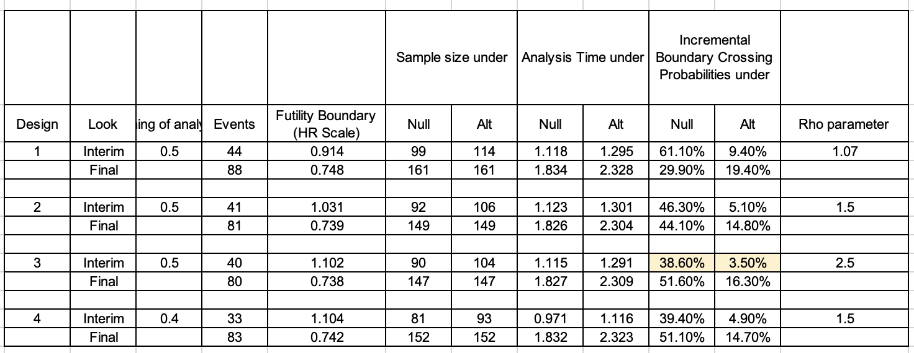

```{r}
library(ggplot2)
library(rpact)
```

# Assumptions

In this clinical trial design, we assume an 80% power ($\beta = 0.2$) and a one-sided significance level ($\alpha$) of 0.1. Subjects will be followed for a maximum of 1 year, with the last subject being followed for 0.5 years. The accrual time is 1.83 years, and the study duration is 2.33 years. The hazard rate ($\lambda$) for the placebo group is assumed to be 1.2 per year. The hazard ratios are set at 0.6, 0.7, 0.8, and 0.9, assuming an exponential distribution of events. The trial uses a 2:1 allocation ratio, meaning two subjects in the treatment group for every one subject in the placebo group. This trial does not allow for early stopping due to efficacy, ensuring that the study reaches its planned conclusion unless futility is determined.

# Compare rpact results with EAST results

## EAST results

The table below shows the EAST results from Gaya. This is a fixed sample design with 48 subjects per arm and a total of 78 events. The allocation rate is 2:1 and other assumptions remain the same.



## rpact results

What I did for replicating the results:

1.  Since rpact did not have an output function for the rho parameter, I defined the beta spending at the interim analysis manually at the first step.
2.  Then I returned the results for the exit probability for futility at the interim analysis and compared with the highlighted values in the table. We can find that we will get the same values.

```{r}
# rho = 1.07
design <- getDesignGroupSequential(kMax = 2, typeOfDesign = "noEarlyEfficacy",
                                   alpha = 0.1, typeBetaSpending = "bsUser",
                                   userBetaSpending = c(0.095, 0.199))

summary(getPowerSurvival(design, directionUpper = FALSE, lambda2 = 1.2,
                         hazardRatio = 0.6,
                         maxNumberOfEvents = 88, allocationRatioPlanned = 2,
                         accrualTime = c(0, 1.83), accrualIntensity = 87.9
                         )
        )
```

## Conclusion

The results are the same. This gives us confidence to move forward with rpact. I used the Beta Spending O'Brien & Fleming function (bsOF) for later analysis in rpact because it is the internal function, but I am open to other methods based on needs.

## Other code for reference

Final results are in .xlsx file attached.

### Allocation 2:1

```{r}
# rho = 1.5
design <- getDesignGroupSequential(kMax = 2, typeOfDesign = "noEarlyEfficacy",
                                   alpha = 0.1, typeBetaSpending = "bsUser",
                                   userBetaSpending = c(0.070, 0.198))

summary(getPowerSurvival(design, directionUpper = FALSE, lambda2 = 1.2,
                         hazardRatio = 0.6,
                         maxNumberOfEvents = 81, allocationRatioPlanned = 2,
                         accrualTime = c(0, 1.83), accrualIntensity = 81.4))
```

```{r}
# rho = 2
design <- getDesignGroupSequential(kMax = 2, typeOfDesign = "noEarlyEfficacy",
                                   alpha = 0.1, typeBetaSpending = "bsUser",
                                   userBetaSpending = c(0.05, 0.2))

summary(getPowerSurvival(design, directionUpper = FALSE, lambda2 = 1.2,
                         hazardRatio = 0.6,
                         maxNumberOfEvents = 81, allocationRatioPlanned = 2,
                         accrualTime = c(0, 1.83), accrualIntensity = 81.4))
```

```{r}
# rho = 2.5
design <- getDesignGroupSequential(kMax = 2, typeOfDesign = "noEarlyEfficacy",
                                   alpha = 0.1, typeBetaSpending = "bsUser",
                                   userBetaSpending = c(0.035, 0.198))

summary(getPowerSurvival(design, directionUpper = FALSE, lambda2 = 1.2,
                         hazardRatio = 0.6,
                         maxNumberOfEvents = 80, allocationRatioPlanned = 2,
                         accrualTime = c(0, 1.83), accrualIntensity = 80.3))
```

```{r}
# rho = 1.5
design <- getDesignGroupSequential(typeOfDesign = "noEarlyEfficacy",
                                   alpha = 0.1, typeBetaSpending = "bsUser",
                                   userBetaSpending = c(0.050, 0.198),
                                   informationRates = c(0.4, 1)
                                   )

summary(getPowerSurvival(design, directionUpper = FALSE, lambda2 = 1.2,
                         hazardRatio = 0.6,
                         maxNumberOfEvents = 83, allocationRatioPlanned = 2,
                         accrualTime = c(0, 1.83), accrualIntensity = 83.1))
```

### Allocation 1:1

```{r}
# rho = 1
design <- getDesignGroupSequential(kMax = 2, typeOfDesign = "noEarlyEfficacy",
                                   alpha = 0.1, typeBetaSpending = "bsUser",
                                   userBetaSpending = c(0.1, 0.2))

summary(getPowerSurvival(design, directionUpper = FALSE, lambda2 = 1.2,
                         hazardRatio = 0.6,
                         maxNumberOfEvents = 79,
                         accrualTime = c(0, 1.83), accrualIntensity = 74.9))
```

```{r}
# rho = 1.75
design <- getDesignGroupSequential(kMax = 2, typeOfDesign = "noEarlyEfficacy",
                                   alpha = 0.1, typeBetaSpending = "bsUser",
                                   userBetaSpending = c(0.059, 0.198))

summary(getPowerSurvival(design, directionUpper = FALSE, lambda2 = 1.2,
                         hazardRatio = 0.6,
                         maxNumberOfEvents = 73,
                         accrualTime = c(0, 1.83), accrualIntensity = 69.4))
```

```{r}
# rho = 2.5
design <- getDesignGroupSequential(kMax = 2, typeOfDesign = "noEarlyEfficacy",
                                   alpha = 0.1, typeBetaSpending = "bsUser",
                                   userBetaSpending = c(0.035, 0.198))

summary(getPowerSurvival(design, directionUpper = FALSE, lambda2 = 1.2,
                         hazardRatio = 0.6,
                         maxNumberOfEvents = 71,
                         accrualTime = c(0, 1.83), accrualIntensity = 67.2))
```

```{r}
# rho = 1
design <- getDesignGroupSequential(typeOfDesign = "noEarlyEfficacy",
                                   alpha = 0.1, typeBetaSpending = "bsUser",
                                   userBetaSpending = c(0.08, 0.2),
                                   informationRates = c(0.4, 1)
                                   )

summary(getPowerSurvival(design, directionUpper = FALSE, lambda2 = 1.2,
                         hazardRatio = 0.6,
                         maxNumberOfEvents = 78,
                         accrualTime = c(0, 1.83), accrualIntensity = 74.3))
```

# Task

1.  Given an 80% power ($\beta$) and a one-sided significance level ($\alpha$) of 0.1, calculate the sample size needed to achieve this goal for a hazard ratio (HR) of 0.6.

2.  Replicate the power based on a fixed sample size derived in step 1 to check the accuracy of the calculation.

3.  Generalize the results to different hazard ratios of 0.6, 0.7, 0.8, and 0.9.

    1.  Given an 80% power ($\beta$) and a one-sided significance level ($\alpha$) of 0.1, calculate the sample size needed to achieve this goal for different hazard ratios.

    2.  Calculate the power based on the sample size for HR = 0.6 to check how different hazard ratios influence the probability.

# Design

## Code and Output

```{r}
design <- getDesignGroupSequential(kMax = 2, typeOfDesign = "noEarlyEfficacy",
                                   alpha = 0.1, typeBetaSpending = "bsOF")
summary(design)
```

## Results and Interpretation

`Futility probabilities under H1` = `Cumulative beta spent` = 0.0699

This design includes an O'Brien & Fleming beta spending approach, where the probability of stopping for futility is controlled and accumulates across stages.

# HR = 0.6

## Introduction

My goal in this section will focus on two things:

1.  Defining a fixed power and calculating the sample size.

2.  Calculating power based on a fixed sample size.

We can further find in this section that the sample size corresponds to the power, i.e., the sample size calculated after the power is determined in the first step can get the same power in the second step.

## Sample Size

### Code and Output

```{r}
accrualTime = c(0, 1.83)
studyDuration = 2.33

summary(getSampleSizeSurvival(design, lambda2 = 1.2, hazardRatio = 0.6,
                              allocationRatioPlanned = 2, accrualTime = c(0, 1.83),
                              followUpTime = min(studyDuration - max(accrualTime), 1)
                              )
        )
```

### Results and Interpretation

The calculation indicates that for an 80% power and a one-sided significance level of 0.1, the sample sizes required are 97.7 subjects in the first stage and 124.6 subjects in the second stage. The cumulative number of events expected is 83.1. The overall exit probability for futility under the null hypothesis ($H_0$) is 53.04%, and under the alternative hypothesis ($H_1$), it is 6.99%. The expected study duration is approximately 2.27 years. This design ensures that the study will have sufficient power to detect the specified hazard ratio with the given parameters.

## Power

### Assumptions and Code Explanations

`directionUpper = FALSE` indicates that the incidence of treatment arm is lower than placebo.

`typeOfComputation = "Schoenfeld"` shows that it is based on the proportional hazards model and provides log-rank tests to compare the survival curves.

`kappa = 1` stands for the exponential survival distribution.

`maxNumberOfEvents` uses the data 83.1 calculated in the previous sample size section.

`accrualIntensity` is calculated as: max Number Of Subjects / accrual time. In this example, I am using the data calculated in the previous sample size section, which is 124.6/1.83 = 68.09.

Both codes will give exactly the same result. The only difference in the code is `accrualIntensity = 68.09` and `maxNumberOfSubjects = 124.6`, but as we said, they mean the same thing and can be converted to each other.

### Code and Output

```{r, eval=FALSE}
summary(getPowerSurvival(design, thetaH0 = 1, typeOfComputation = "Schoenfeld",
                         directionUpper = FALSE, lambda2 = 1.2, hazardRatio = 0.6,
                         maxNumberOfSubjects = 124.6, maxNumberOfEvents = 83.1,
                         allocationRatioPlanned = 2, accrualTime = c(0, 1.83), kappa = 1))
```

```{r}
summary(getPowerSurvival(design, thetaH0 = 1, typeOfComputation = "Schoenfeld",
                         directionUpper = FALSE, lambda2 = 1.2, hazardRatio = 0.6,
                         maxNumberOfEvents = 83.1, allocationRatioPlanned = 2,
                         accrualTime = c(0, 1.83), accrualIntensity = 68.09, kappa = 1))
```

### Results and Interpretation

`Exit probability for futility (under H0)` = 0.5304 and `Exit probability for futility (under H1)` = 0.0700.

This design allows for early stopping due to futility, with a 53.04% probability of stopping if the null hypothesis is true (no treatment effect) and a 7% probability if the alternative hypothesis is true (treatment effect).

## Conclusion

In this section, our results successfully conclude that sample size corresponds to power.

Specifically,

`Number of subjects` = 124.6 and `Cumulative number of events` = 83.1

corresponds to

`Exit probability for futility (under H0)` = 0.5304 and `Exit probability for futility (under H1)` = 0.0700.

## Next Step:

I am now trying to generalize the case of HR = 0.6 to different HRs.

The ideas are still broken down into two parts:

1.  Given the power (derived from alpha/beta), we can get different sample sizes for different HRs.

2.  Given the sample size (which I based on the HR = 0.6 case while referring to Gaya's calculations in EAST, but this is open to discussion), calculate power for the case of different HRs.

Only the HRs in the code are changed.

# Combine Different HRs

## Sample Size

### Code and Output

```{r}
summary(getSampleSizeSurvival(design, lambda2 = 1.2, hazardRatio = c(0.6, 0.7, 0.8, 0.9),
                              allocationRatioPlanned = 2, accrualTime = c(0, 1.83),
                              followUpTime = min(studyDuration - max(accrualTime), 1)))
```

### Results and Interpretation

Can focus on: `Number of subjects` and `Cumulative number of events`.

The sample size and number of events required for the trial increase significantly as the HR approaches 1. This is because detecting smaller differences between groups requires a larger sample size and more events to achieve the desired statistical power (80%). For instance, to detect an HR of 0.6, only 124.6 subjects and 83.1 events are needed. However, for an HR of 0.9, the trial would require 2583.0 subjects and 1954.4 events. This reflects the increased difficulty in detecting smaller differences and the need for more data to draw reliable conclusions.

Below is a sample output table that summarizes the important output:

| Hazard Ratio (HR) | Number of Subjects (Stage 1) | Number of Subjects (Stage 2) | Cumulative Number of Events (Stage 1) | Cumulative Number of Events (Stage 2) |
|---------------|---------------|---------------|---------------|---------------|
| 0.6               | 97.7                         | 124.6                        | 41.6                                  | 83.1                                  |
| 0.7               | 188.9                        | 242.8                        | 85.3                                  | 170.5                                 |
| 0.8               | 459.3                        | 595.5                        | 217.9                                 | 435.7                                 |
| 0.9               | 1975.2                       | 2583.0                       | 977.2                                 | 1954.4                                |

## Power

### Code and Output

```{r, eval=FALSE}
summary(getPowerSurvival(design, thetaH0 = 1, typeOfComputation = "Schoenfeld",
                         directionUpper = FALSE, lambda2 = 1.2,
                         hazardRatio = c(0.6, 0.7, 0.8, 0.9),
                         maxNumberOfSubjects = 124.6, maxNumberOfEvents = 83.1,
                         allocationRatioPlanned = 2, accrualTime = c(0, 1.83), kappa = 1))
```

```{r}
summary(getPowerSurvival(design, thetaH0 = 1, typeOfComputation = "Schoenfeld",
                         directionUpper = FALSE, lambda2 = 1.2,
                         hazardRatio = c(0.6, 0.7, 0.8, 0.9),
                         maxNumberOfEvents = 83.1, allocationRatioPlanned = 2,
                         accrualTime = c(0, 1.83), accrualIntensity = 68.09, kappa = 1))
```

### Results and Interpretation

-   **Exit probability for futility (under H1) given the overall sample size = 124.6:**

    -   HR = 0.6: 7.00% probability of stopping early for futility (under H1).

    -   HR = 0.7: 15.68% probability of stopping early for futility (under H1).

    -   HR = 0.8: 27.37% probability of stopping early for futility (under H1).

    -   HR = 0.9: 40.37% probability of stopping early for futility (under H1).

-   **Expected number of subjects under H1:**

    -   Expected number of subjects under H1 decreases from 122.7 (HR = 0.6) to 109.9 (HR = 0.9).

    -   The expected number of subjects decreases with increasing HR values, indicating a higher likelihood of early stopping as the treatment effect diminishes.

Below is a sample output table that summarizes the important output:

| HR  | Exit Probability for Efficacy Stage 1 | Exit Probability for Futility Stage 1 | Number of Subjects Stage 1 | Number of Subjects Stage 2 | Expected Number of Subjects |
|------------|------------|------------|------------|------------|------------|
| 0.6 | 0                                     | 0.0700                                | 97.7                       | 124.6                      | 122.7                       |
| 0.7 | 0                                     | 0.1568                                | 93.9                       | 124.6                      | 119.8                       |
| 0.8 | 0                                     | 0.2737                                | 90.8                       | 124.6                      | 115.3                       |
| 0.9 | 0                                     | 0.4037                                | 88.1                       | 124.6                      | 109.9                       |

# Multi-Arm GSD (both arms)

## Assumption

In this fixed sample size design, we ensure an overall one-sided significance level of 0.1 (alpha = 0.1) and a power of 80% (beta = 0.2). This design was configured to avoid early efficacy stopping and utilized **O'Brien & Fleming beta spending function** approach. We assumed hazard ratios of 0.6 and 0.7 for the high dose and low dose treatment arms. The study planned for 45 events in the first stage and 90 cumulative events by the second stage, with an allocation ratio of 1:1 for two arms.

## Code and Output

```{r}
design <- getDesignInverseNormal(
  kMax = 2, 
  alpha = 0.1,
  beta = 0.2,
  typeOfDesign = "noEarlyEfficacy",
  typeBetaSpending = "bsUser",
  userBetaSpending = c(0.059, 0.198) # rho = 1.75
  )

hazardRatios <- c(0.6, 0.7)
plannedEvents <- c(45, 90)

simulationResults <- getSimulationMultiArmSurvival(
  design = design,
  activeArms = 2,
  effectMatrix = matrix(hazardRatios, ncol = 2, byrow = TRUE),
  typeOfShape = "userDefined", # effect matrix
  intersectionTest = "Hierarchical",
  directionUpper = FALSE,
  typeOfSelection = "all",
  plannedEvents = plannedEvents,
  allocationRatioPlanned = 1,
  minNumberOfEventsPerStage = c(NA_real_, 40),
  maxNumberOfEventsPerStage = c(NA_real_, 60),
  conditionalPower = 0.8,
  maxNumberOfIterations = 5000,
  seed = 12345
)

summary(simulationResults)
```

## Results and Interpretation

-   Probability of rejecting each treatment group in stage 2:

    -   High dose vs. control: 76.84%

    -   Low dose vs. control: 49.30%

-   Exit probability for futility: 9.4%

-   Conditional power: 80.49%

We can find that the probability of rejecting at least one hypothesis in the second stage is 76.84%. Moreover, overall exit probability is 9.40%.

# Multi-Arm GSD (best arm)

## Introduction

In this section, we wish to select the best arm for the second stage of the analysis. This means that we will drop an arm in the interim analysis. We can do this by defining `typeOfSelection = "best"` in the function `getSimulationMultiArmSurvival`.

## Assumption

As mentioned in the previous section, this fixed sample size design can ensure an overall one-sided significance level of 0.1 (alpha = 0.1) and a power of 80% (beta = 0.2). Additionally, this design was configured to avoid early efficacy stopping and utilized **O'Brien & Fleming beta spending function** approach. We assumed hazard ratios of 0.6 and 0.7 for the high dose and low dose treatment arms. The study planned for 45 events in the first stage and 90 cumulative events by the second stage, with an allocation ratio of 1:1 for two arms.

## Code and Output

```{r}
design <- getDesignInverseNormal(
  kMax = 2, 
  alpha = 0.1,
  beta = 0.2,
  typeOfDesign = "noEarlyEfficacy",
  typeBetaSpending = "bsUser",
  userBetaSpending = c(0.059, 0.198) # rho = 1.75
  )

hazardRatios <- c(0.6, 0.7)
effectMatrix <- matrix(hazardRatios, ncol = 2, byrow = TRUE)
plannedEvents <- c(45, 90)

simulationResults <- getSimulationMultiArmSurvival(
  design = design,
  activeArms = 2,
  effectMatrix = effectMatrix,
  typeOfShape = "userDefined", # effect matrix
  intersectionTest = "Hierarchical",
  # intersectionTest = "Dunnett",
  directionUpper = FALSE,
  typeOfSelection = "best",
  plannedEvents = plannedEvents,
  allocationRatioPlanned = 1,
  minNumberOfEventsPerStage = c(NA_real_, 40),
  maxNumberOfEventsPerStage = c(NA_real_, 60),
  conditionalPower = 0.8,
  maxNumberOfIterations = 5000,
  seed = 12345
)

summary(simulationResults)
```

## Results and Interpretation

-   In stage 1, no efficacy boundaries were used, which is consistent with our hypothesis. In stage 2, the probability of the trial rejecting at least one hypothesis was 58.72%, as was the success rate.

-   The exit probability for futility at interim analysis was 8.74%.

-   Higher doses are more likely to be selected (with a probability of 63.5%) compared to lower doses (with a probability of 63.5%), so higher doses will be preferred in stage 2 as the "best" dose.

-   The conditional power achieved in the second phase was 80.32%, which is close to the target value of 80%.

# Question:

-   If we chose `intersectionTest = "Dunnett"`, we can get following results:
    -   Rejected arms per stage
    -   Treatment arm vs. control 0 0.5418
    -   Treatment arm vs. control 0 0.2412
-   However, if we chose `intersectionTest = "Hierarchical"`, we can get following results:
    -   Rejected arms per stage
    -   Treatment arm vs. control 0 0.5872
    -   Treatment arm vs. control 0 0
-   The second treatment arm in hierarchical testing will get zero at the second stage no matter the value of parameters. I am not very sure why it happened? How to understand it and interpret the results? Is my current understanding correct:
    -   If the first treatment arm rejects null, we stop and conclude that at least one treatment arm is valid. If the first treatment group fails to reject null, then the second treatment group cannot reject null either. In this way, the final result will be 0.

```{r, eval=FALSE}
design <- getDesignInverseNormal(
  kMax = 2, 
  alpha = 0.1,
  beta = 0.2,
  typeOfDesign = "noEarlyEfficacy",
  typeBetaSpending = "bsOF"
)

hazardRatios <- c(0.6, 0.7)
effectMatrix <- matrix(hazardRatios, ncol = 2, byrow = TRUE)
plannedEvents <- c(45, 90)

simulationResults <- getSimulationMultiArmSurvival(
  design = design,
  activeArms = 2,
  effectMatrix = effectMatrix,
  typeOfShape = "userDefined",
  intersectionTest = "Dunnett",
  directionUpper = FALSE,
  typeOfSelection = "best",
  plannedEvents = plannedEvents,
  allocationRatioPlanned = 1,
  minNumberOfEventsPerStage = c(NA_real_, 40),
  maxNumberOfEventsPerStage = c(NA_real_, 60),
  conditionalPower = 0.8,
  maxNumberOfIterations = 5000,
  seed = 12345
)

summary(simulationResults)
```
