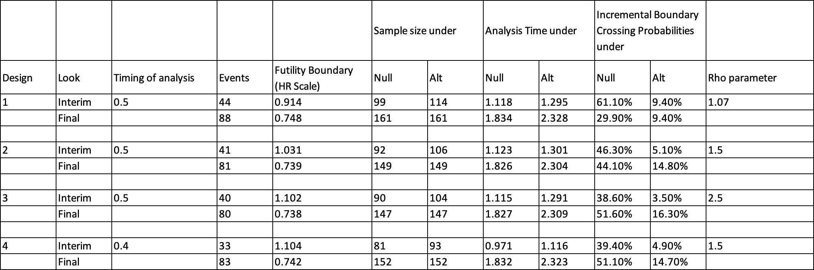

CSL 787-2001 Design
================
Huanyu Chen
2024-07-25

``` r
library(ggplot2)
library(rpact)
```

# Assumptions

In this clinical trial design, we assume an 80% power ($\beta$) and a
one-sided significance level ($\alpha$) of 0.1. Subjects will be
followed for a maximum of 1 year, with the last subject being followed
for 0.5 years. The accrual time is 1.83 years, and the study duration is
2.33 years. The hazard rate ($\lambda$) for the placebo group is assumed
to be 1.2 per year. The hazard ratios are set at 0.6, 0.7, 0.8, and 0.9,
assuming an exponential distribution of events. The trial uses a 2:1
allocation ratio, meaning two subjects in the treatment group for every
one subject in the placebo group. This trial does not allow for early
stopping due to efficacy, ensuring that the study reaches its planned
conclusion unless futility is determined.

# Task

1.  Given an 80% power ($\beta$) and a one-sided significance level
    ($\alpha$) of 0.1, calculate the sample size needed to achieve this
    goal for a hazard ratio (HR) of 0.6.

2.  Replicate the power based on a fixed sample size derived in step 1
    to check the accuracy of the calculation.

3.  Generalize the results to different hazard ratios of 0.6, 0.7, 0.8,
    and 0.9.

    1.  Given an 80% power ($\beta$) and a one-sided significance level
        ($\alpha$) of 0.1, calculate the sample size needed to achieve
        this goal for different hazard ratios.

    2.  Calculate the power based on the sample size for HR = 0.6 to
        check how different hazard ratios influence the probability.

# Compare rpact results with EAST results

## EAST results

The table below shows the EAST results from Gaya. This is a fixed sample
design with 48 subjects per arm and a total of 78 events. The allocation
rate is 2:1 and other assumptions remain the same.



## rpact results

What I did for replicating the results:

1.  Since rpact did not have an output function for the rho parameter, I
    defined the beta spending at the interim analysis manually at the
    first step.
2.  Then I returned the results for the exit probability for futility at
    the interim analysis and compared with the highlighted values in the
    table. We can find that we will get the same values.

``` r
design <- getDesignGroupSequential(kMax = 2, typeOfDesign = "noEarlyEfficacy",
                                   alpha = 0.1, typeBetaSpending = "bsUser",
                                   userBetaSpending = c(0.035, 0.2))
summary(getPowerSurvival(design, directionUpper = FALSE, lambda2 = 1.2, hazardRatio = 0.6,
                         maxNumberOfEvents = 80, allocationRatioPlanned = 2,
                         accrualTime = c(0, 1.83), accrualIntensity = 79))
```

*Power calculation for a survival endpoint*

Sequential analysis with a maximum of 2 looks (group sequential design),
overall significance level 10% (one-sided). The results were calculated
for a two-sample logrank test, H0: hazard ratio = 1, power directed
towards smaller values, H1: hazard ratio = 0.6, control lambda(2) = 1.2,
maximum number of events = 80, planned allocation ratio = 2, accrual
time = 1.83, accrual intensity = 79.

| Stage                                    | 1      | 2      |
|------------------------------------------|--------|--------|
| Planned information rate                 | 50%    | 100%   |
| Efficacy boundary (z-value scale)        | Inf    | 1.282  |
| Futility boundary (z-value scale)        | -0.295 |        |
| Cumulative power                         | 0      | 0.8023 |
| Number of subjects                       | 101.3  | 144.6  |
| Expected number of subjects under H1     | 143.1  |        |
| Expected number of events                | 78.6   |        |
| Cumulative number of events              | 40.0   | 80.0   |
| Analysis time                            | 1.28   | 1.98   |
| Expected study duration                  | 1.95   |        |
| Cumulative alpha spent                   | 0      | 0.1000 |
| Cumulative beta spent                    | 0.0350 | 0.2000 |
| One-sided local significance level       | 0      | 0.1000 |
| Efficacy boundary (t)                    | 0      | 0.738  |
| Futility boundary (t)                    | 1.104  |        |
| Overall exit probability (under H0)      | 0.3840 |        |
| Overall exit probability (under H1)      | 0.0345 |        |
| Exit probability for efficacy (under H0) | 0      |        |
| Exit probability for efficacy (under H1) | 0      |        |
| Exit probability for futility (under H0) | 0.3840 |        |
| Exit probability for futility (under H1) | 0.0345 |        |

Legend:

- *(t)*: treatment effect scale

## Conclusion

The results are the same. This gives us confidence to move forward with
rpact. I used the Beta Spending O’Brien & Fleming function (bsOF) for
later analysis in rpact because it is the internal function, but I am
open to other methods based on needs.

# Design

## Code and Output

``` r
design <- getDesignGroupSequential(kMax = 2, typeOfDesign = "noEarlyEfficacy",
                                   alpha = 0.1, typeBetaSpending = "bsOF")
summary(design)
```

*Sequential analysis with a maximum of 2 looks (group sequential
design)*

No early efficacy stop design, non-binding futility, one-sided overall
significance level 10%, power 80%, undefined endpoint, inflation factor
1.0695, ASN H1 1.0321, ASN H01 0.9401, ASN H0 0.7859.

| Stage                             | 1      | 2      |
|-----------------------------------|--------|--------|
| Planned information rate          | 50%    | 100%   |
| Efficacy boundary (z-value scale) | Inf    | 1.282  |
| Stage levels (one-sided)          | 0      | 0.1000 |
| Futility boundary (z-value scale) | 0.076  |        |
| Cumulative alpha spent            | 0      | 0.1000 |
| Cumulative beta spent             | 0.0699 | 0.2000 |
| Cumulative power                  | 0      | 0.8000 |
| Futility probabilities under H1   | 0.070  |        |

## Results and Interpretation

`Futility probabilities under H1` = `Cumulative beta spent` = 0.0699

This design includes an O’Brien & Fleming beta spending approach, where
the probability of stopping for futility is controlled and accumulates
across stages.

# HR = 0.6

## Introduction

My goal in this section will focus on two things:

1.  Defining a fixed power and calculating the sample size.

2.  Calculating power based on a fixed sample size.

We can further find in this section that the sample size corresponds to
the power, i.e., the sample size calculated after the power is
determined in the first step can get the same power in the second step.

## Sample Size

### Code and Output

``` r
accrualTime = c(0, 1.83)
studyDuration = 2.33

summary(getSampleSizeSurvival(design, lambda2 = 1.2, hazardRatio = 0.6,
                              allocationRatioPlanned = 2, accrualTime = c(0, 1.83),
                              followUpTime = min(studyDuration - max(accrualTime), 1)
                              )
        )
```

*Sample size calculation for a survival endpoint*

Sequential analysis with a maximum of 2 looks (group sequential design),
overall significance level 10% (one-sided). The results were calculated
for a two-sample logrank test, H0: hazard ratio = 1, H1: hazard ratio =
0.6, control lambda(2) = 1.2, planned allocation ratio = 2, accrual time
= 1.83, accrual intensity = 68.1, follow-up time = 0.5, power 80%.

| Stage                                    | 1      | 2      |
|------------------------------------------|--------|--------|
| Planned information rate                 | 50%    | 100%   |
| Efficacy boundary (z-value scale)        | Inf    | 1.282  |
| Futility boundary (z-value scale)        | 0.076  |        |
| Cumulative power                         | 0      | 0.8000 |
| Number of subjects                       | 97.7   | 124.6  |
| Expected number of subjects under H1     | 122.7  |        |
| Cumulative number of events              | 41.6   | 83.1   |
| Analysis time                            | 1.44   | 2.33   |
| Expected study duration                  | 2.27   |        |
| Cumulative alpha spent                   | 0      | 0.1000 |
| Cumulative beta spent                    | 0.0699 | 0.2000 |
| One-sided local significance level       | 0      | 0.1000 |
| Efficacy boundary (t)                    | 0      | 0.742  |
| Futility boundary (t)                    | 0.975  |        |
| Overall exit probability (under H0)      | 0.5304 |        |
| Overall exit probability (under H1)      | 0.0699 |        |
| Exit probability for efficacy (under H0) | 0      |        |
| Exit probability for efficacy (under H1) | 0      |        |
| Exit probability for futility (under H0) | 0.5304 |        |
| Exit probability for futility (under H1) | 0.0699 |        |

Legend:

- *(t)*: treatment effect scale

### Results and Interpretation

The calculation indicates that for an 80% power and a one-sided
significance level of 0.1, the sample sizes required are 97.7 subjects
in the first stage and 124.6 subjects in the second stage. The
cumulative number of events expected is 83.1. The overall exit
probability for futility under the null hypothesis ($H_0$) is 53.04%,
and under the alternative hypothesis ($H_1$), it is 6.99%. The expected
study duration is approximately 2.27 years. This design ensures that the
study will have sufficient power to detect the specified hazard ratio
with the given parameters.

## Power

### Assumptions and Code Explanations

`directionUpper = FALSE` indicates that the incidence of treatment arm
is lower than placebo.

`typeOfComputation = "Schoenfeld"` shows that it is based on the
proportional hazards model and provides log-rank tests to compare the
survival curves.

`kappa = 1` stands for the exponential survival distribution.

`maxNumberOfEvents` uses the data 83.1 calculated in the previous sample
size section.

`accrualIntensity` is calculated as: max Number Of Subjects / accrual
time. In this example, I am using the data calculated in the previous
sample size section, which is 124.6/1.83 = 68.09.

Both codes will give exactly the same result. The only difference in the
code is `accrualIntensity = 68.09` and `maxNumberOfSubjects = 124.6`,
but as we said, they mean the same thing and can be converted to each
other.

### Code and Output

``` r
summary(getPowerSurvival(design, thetaH0 = 1, typeOfComputation = "Schoenfeld",
                         directionUpper = FALSE, lambda2 = 1.2, hazardRatio = 0.6,
                         maxNumberOfSubjects = 124.6, maxNumberOfEvents = 83.1,
                         allocationRatioPlanned = 2, accrualTime = c(0, 1.83), kappa = 1))
```

``` r
summary(getPowerSurvival(design, thetaH0 = 1, typeOfComputation = "Schoenfeld",
                         directionUpper = FALSE, lambda2 = 1.2, hazardRatio = 0.6,
                         maxNumberOfEvents = 83.1, allocationRatioPlanned = 2,
                         accrualTime = c(0, 1.83), accrualIntensity = 68.09, kappa = 1))
```

*Power calculation for a survival endpoint*

Sequential analysis with a maximum of 2 looks (group sequential design),
overall significance level 10% (one-sided). The results were calculated
for a two-sample logrank test, H0: hazard ratio = 1, power directed
towards smaller values, H1: hazard ratio = 0.6, control lambda(2) = 1.2,
maximum number of events = 84, planned allocation ratio = 2, accrual
time = 1.83, accrual intensity = 68.1.

| Stage                                    | 1      | 2      |
|------------------------------------------|--------|--------|
| Planned information rate                 | 50%    | 100%   |
| Efficacy boundary (z-value scale)        | Inf    | 1.282  |
| Futility boundary (z-value scale)        | 0.076  |        |
| Cumulative power                         | 0      | 0.7998 |
| Number of subjects                       | 97.7   | 124.6  |
| Expected number of subjects under H1     | 122.7  |        |
| Expected number of events                | 80.2   |        |
| Cumulative number of events              | 41.5   | 83.1   |
| Analysis time                            | 1.43   | 2.33   |
| Expected study duration                  | 2.27   |        |
| Cumulative alpha spent                   | 0      | 0.1000 |
| Cumulative beta spent                    | 0.0699 | 0.2000 |
| One-sided local significance level       | 0      | 0.1000 |
| Efficacy boundary (t)                    | 0      | 0.742  |
| Futility boundary (t)                    | 0.975  |        |
| Overall exit probability (under H0)      | 0.5304 |        |
| Overall exit probability (under H1)      | 0.0700 |        |
| Exit probability for efficacy (under H0) | 0      |        |
| Exit probability for efficacy (under H1) | 0      |        |
| Exit probability for futility (under H0) | 0.5304 |        |
| Exit probability for futility (under H1) | 0.0700 |        |

Legend:

- *(t)*: treatment effect scale

### Results and Interpretation

`Exit probability for futility (under H0)` = 0.5304 and
`Exit probability for futility (under H1)` = 0.0700.

This design allows for early stopping due to futility, with a 53.04%
probability of stopping if the null hypothesis is true (no treatment
effect) and a 7% probability if the alternative hypothesis is true
(treatment effect).

## Conclusion

In this section, our results successfully conclude that sample size
corresponds to power.

Specifically,

`Number of subjects` = 124.6 and `Cumulative number of events` = 83.1

corresponds to

`Exit probability for futility (under H0)` = 0.5304 and
`Exit probability for futility (under H1)` = 0.0700.

## Next Step:

I am now trying to generalize the case of HR = 0.6 to different HRs.

The ideas are still broken down into two parts:

1.  Given the power (derived from alpha/beta), we can get different
    sample sizes for different HRs.

2.  Given the sample size (which I based on the HR = 0.6 case while
    referring to Gaya’s calculations in EAST, but this is open to
    discussion), calculate power for the case of different HRs.

Only the HRs in the code are changed.

# Combine Different HRs

## Sample Size

### Code and Output

``` r
summary(getSampleSizeSurvival(design, lambda2 = 1.2, hazardRatio = c(0.6, 0.7, 0.8, 0.9),
                              allocationRatioPlanned = 2, accrualTime = c(0, 1.83),
                              followUpTime = min(studyDuration - max(accrualTime), 1)))
```

*Sample size calculation for a survival endpoint*

Sequential analysis with a maximum of 2 looks (group sequential design),
overall significance level 10% (one-sided). The results were calculated
for a two-sample logrank test, H0: hazard ratio = 1, H1: hazard ratio as
specified, control lambda(2) = 1.2, planned allocation ratio = 2,
accrual time = 1.83, follow-up time = 0.5, power 80%.

| Stage                                          | 1      | 2      |
|------------------------------------------------|--------|--------|
| Planned information rate                       | 50%    | 100%   |
| Efficacy boundary (z-value scale)              | Inf    | 1.282  |
| Futility boundary (z-value scale)              | 0.076  |        |
| Cumulative power                               | 0      | 0.8000 |
| Number of subjects, HR = 0.6                   | 97.7   | 124.6  |
| Number of subjects, HR = 0.7                   | 188.9  | 242.8  |
| Number of subjects, HR = 0.8                   | 459.3  | 595.5  |
| Number of subjects, HR = 0.9                   | 1975.2 | 2583.0 |
| Expected number of subjects under H1, HR = 0.6 | 122.7  |        |
| Expected number of subjects under H1, HR = 0.7 | 239.1  |        |
| Expected number of subjects under H1, HR = 0.8 | 586.0  |        |
| Expected number of subjects under H1, HR = 0.9 | 2540.5 |        |
| Cumulative number of events, HR = 0.6          | 41.6   | 83.1   |
| Cumulative number of events, HR = 0.7          | 85.3   | 170.5  |
| Cumulative number of events, HR = 0.8          | 217.9  | 435.7  |
| Cumulative number of events, HR = 0.9          | 977.2  | 1954.4 |
| Analysis time, HR = 0.6                        | 1.44   | 2.33   |
| Analysis time, HR = 0.7                        | 1.42   | 2.33   |
| Analysis time, HR = 0.8                        | 1.41   | 2.33   |
| Analysis time, HR = 0.9                        | 1.40   | 2.33   |
| Expected study duration, HR = 0.6              | 2.27   |        |
| Expected study duration, HR = 0.7              | 2.27   |        |
| Expected study duration, HR = 0.8              | 2.27   |        |
| Expected study duration, HR = 0.9              | 2.26   |        |
| Cumulative alpha spent                         | 0      | 0.1000 |
| Cumulative beta spent                          | 0.0699 | 0.2000 |
| One-sided local significance level             | 0      | 0.1000 |
| Efficacy boundary (t), HR = 0.6                | 0      | 0.742  |
| Efficacy boundary (t), HR = 0.7                | 0      | 0.812  |
| Efficacy boundary (t), HR = 0.8                | 0      | 0.878  |
| Efficacy boundary (t), HR = 0.9                | 0      | 0.940  |
| Futility boundary (t), HR = 0.6                | 0.975  |        |
| Futility boundary (t), HR = 0.7                | 0.983  |        |
| Futility boundary (t), HR = 0.8                | 0.989  |        |
| Futility boundary (t), HR = 0.9                | 0.995  |        |
| Overall exit probability (under H0)            | 0.5304 |        |
| Overall exit probability (under H1)            | 0.0699 |        |
| Exit probability for efficacy (under H0)       | 0      |        |
| Exit probability for efficacy (under H1)       | 0      |        |
| Exit probability for futility (under H0)       | 0.5304 |        |
| Exit probability for futility (under H1)       | 0.0699 |        |

Legend:

- *HR*: hazard ratio
- *(t)*: treatment effect scale

### Results and Interpretation

Can focus on: `Number of subjects` and `Cumulative number of events`.

The sample size and number of events required for the trial increase
significantly as the HR approaches 1. This is because detecting smaller
differences between groups requires a larger sample size and more events
to achieve the desired statistical power (80%). For instance, to detect
an HR of 0.6, only 124.6 subjects and 83.1 events are needed. However,
for an HR of 0.9, the trial would require 2583.0 subjects and 1954.4
events. This reflects the increased difficulty in detecting smaller
differences and the need for more data to draw reliable conclusions.

Below is a sample output table that summarizes the important output:

| Hazard Ratio (HR) | Number of Subjects (Stage 1) | Number of Subjects (Stage 2) | Cumulative Number of Events (Stage 1) | Cumulative Number of Events (Stage 2) |
|-------------------|------------------------------|------------------------------|---------------------------------------|---------------------------------------|
| 0.6               | 97.7                         | 124.6                        | 41.6                                  | 83.1                                  |
| 0.7               | 188.9                        | 242.8                        | 85.3                                  | 170.5                                 |
| 0.8               | 459.3                        | 595.5                        | 217.9                                 | 435.7                                 |
| 0.9               | 1975.2                       | 2583.0                       | 977.2                                 | 1954.4                                |

## Power

### Code and Output

``` r
summary(getPowerSurvival(design, thetaH0 = 1, typeOfComputation = "Schoenfeld",
                         directionUpper = FALSE, lambda2 = 1.2,
                         hazardRatio = c(0.6, 0.7, 0.8, 0.9),
                         maxNumberOfSubjects = 124.6, maxNumberOfEvents = 83.1,
                         allocationRatioPlanned = 2, accrualTime = c(0, 1.83), kappa = 1))
```

``` r
summary(getPowerSurvival(design, thetaH0 = 1, typeOfComputation = "Schoenfeld",
                         directionUpper = FALSE, lambda2 = 1.2,
                         hazardRatio = c(0.6, 0.7, 0.8, 0.9),
                         maxNumberOfEvents = 83.1, allocationRatioPlanned = 2,
                         accrualTime = c(0, 1.83), accrualIntensity = 68.09, kappa = 1))
```

*Power calculation for a survival endpoint*

Sequential analysis with a maximum of 2 looks (group sequential design),
overall significance level 10% (one-sided). The results were calculated
for a two-sample logrank test, H0: hazard ratio = 1, power directed
towards smaller values, H1: hazard ratio as specified, control lambda(2)
= 1.2, maximum number of events = 84, planned allocation ratio = 2,
accrual time = 1.83, accrual intensity = 68.1.

| Stage                                              | 1      | 2      |
|----------------------------------------------------|--------|--------|
| Planned information rate                           | 50%    | 100%   |
| Efficacy boundary (z-value scale)                  | Inf    | 1.282  |
| Futility boundary (z-value scale)                  | 0.076  |        |
| Cumulative power, HR = 0.6                         | 0      | 0.7998 |
| Cumulative power, HR = 0.7                         | 0      | 0.5772 |
| Cumulative power, HR = 0.8                         | 0      | 0.3559 |
| Cumulative power, HR = 0.9                         | 0      | 0.1924 |
| Number of subjects, HR = 0.6                       | 97.7   | 124.6  |
| Number of subjects, HR = 0.7                       | 93.9   | 124.6  |
| Number of subjects, HR = 0.8                       | 90.8   | 124.6  |
| Number of subjects, HR = 0.9                       | 88.1   | 124.6  |
| Expected number of subjects under H1, HR = 0.6     | 122.7  |        |
| Expected number of subjects under H1, HR = 0.7     | 119.8  |        |
| Expected number of subjects under H1, HR = 0.8     | 115.3  |        |
| Expected number of subjects under H1, HR = 0.9     | 109.9  |        |
| Expected number of events, HR = 0.6                | 80.2   |        |
| Expected number of events, HR = 0.7                | 76.6   |        |
| Expected number of events, HR = 0.8                | 71.7   |        |
| Expected number of events, HR = 0.9                | 66.3   |        |
| Cumulative number of events                        | 41.5   | 83.1   |
| Analysis time, HR = 0.6                            | 1.43   | 2.33   |
| Analysis time, HR = 0.7                            | 1.38   | 2.21   |
| Analysis time, HR = 0.8                            | 1.33   | 2.12   |
| Analysis time, HR = 0.9                            | 1.29   | 2.05   |
| Expected study duration, HR = 0.6                  | 2.27   |        |
| Expected study duration, HR = 0.7                  | 2.08   |        |
| Expected study duration, HR = 0.8                  | 1.90   |        |
| Expected study duration, HR = 0.9                  | 1.74   |        |
| Cumulative alpha spent                             | 0      | 0.1000 |
| Cumulative beta spent                              | 0.0699 | 0.2000 |
| One-sided local significance level                 | 0      | 0.1000 |
| Efficacy boundary (t)                              | 0      | 0.742  |
| Futility boundary (t)                              | 0.975  |        |
| Overall exit probability (under H0)                | 0.5304 |        |
| Overall exit probability (under H1)                | 0.0700 |        |
| Exit probability for efficacy (under H0)           | 0      |        |
| Exit probability for efficacy (under H1), HR = 0.6 | 0      |        |
| Exit probability for efficacy (under H1), HR = 0.7 | 0      |        |
| Exit probability for efficacy (under H1), HR = 0.8 | 0      |        |
| Exit probability for efficacy (under H1), HR = 0.9 | 0      |        |
| Exit probability for futility (under H0)           | 0.5304 |        |
| Exit probability for futility (under H1), HR = 0.6 | 0.0700 |        |
| Exit probability for futility (under H1), HR = 0.7 | 0.1568 |        |
| Exit probability for futility (under H1), HR = 0.8 | 0.2737 |        |
| Exit probability for futility (under H1), HR = 0.9 | 0.4037 |        |

Legend:

- *HR*: hazard ratio
- *(t)*: treatment effect scale

### Results and Interpretation

- **Exit probability for futility (under H1) given the overall sample
  size = 124.6:**

  - HR = 0.6: 7.00% probability of stopping early for futility (under
    H1).

  - HR = 0.7: 15.68% probability of stopping early for futility (under
    H1).

  - HR = 0.8: 27.37% probability of stopping early for futility (under
    H1).

  - HR = 0.9: 40.37% probability of stopping early for futility (under
    H1).

- **Expected number of subjects under H1:**

  - Expected number of subjects under H1 decreases from 122.7 (HR = 0.6)
    to 109.9 (HR = 0.9).

  - The expected number of subjects decreases with increasing HR values,
    indicating a higher likelihood of early stopping as the treatment
    effect diminishes.

Below is a sample output table that summarizes the important output:

| HR  | Exit Probability for Efficacy Stage 1 | Exit Probability for Futility Stage 1 | Number of Subjects Stage 1 | Number of Subjects Stage 2 | Expected Number of Subjects |
|-----|---------------------------------------|---------------------------------------|----------------------------|----------------------------|-----------------------------|
| 0.6 | 0                                     | 0.0700                                | 97.7                       | 124.6                      | 122.7                       |
| 0.7 | 0                                     | 0.1568                                | 93.9                       | 124.6                      | 119.8                       |
| 0.8 | 0                                     | 0.2737                                | 90.8                       | 124.6                      | 115.3                       |
| 0.9 | 0                                     | 0.4037                                | 88.1                       | 124.6                      | 109.9                       |

# Multi-Arm GSD (all)

``` r
design <- getDesignInverseNormal(
  kMax = 2, 
  alpha = 0.1,
  beta = 0.2,
  typeOfDesign = "noEarlyEfficacy",
  typeBetaSpending = "bsOF"
)

hazardRatios <- c(0.6, 0.7)
effectMatrix <- matrix(hazardRatios, ncol = 2, byrow = TRUE)
plannedEvents <- c(35, 70)

simulationResults <- getSimulationMultiArmSurvival(
  design = design,
  activeArms = 2,
  effectMatrix = effectMatrix,
  typeOfShape = "userDefined", # effect matrix
  intersectionTest = "Hierarchical",
  directionUpper = FALSE,
  typeOfSelection = "all",
  plannedEvents = plannedEvents,
  allocationRatioPlanned = 2,
  minNumberOfEventsPerStage = c(NA_real_, 30),
  maxNumberOfEventsPerStage = c(NA_real_, 60),
  conditionalPower = 0.8,
  maxNumberOfIterations = 1000,
  seed = 12345
)

summary(simulationResults)
```

*Simulation of a survival endpoint (multi-arm design)*

Sequential analysis with a maximum of 2 looks (inverse normal
combination test design), overall significance level 10% (one-sided).
The results were simulated for a multi-arm logrank test (2 treatments
vs. control), H0: hazard ratio(i) = 1, power directed towards smaller
values, H1: omega_max = 0.7, planned cumulative events = c(35, 70),
planned allocation ratio = 2, effect shape = user defined, intersection
test = Hierarchical, selection = all, effect measure based on effect
estimate, success criterion: all, sample size reassessment: conditional
power = 0.8, minimum events per stage = c(35, 30), maximum events per
stage = c(35, 60), simulation runs = 1000, seed = 12345.

| Stage                              | 1      | 2      |
|------------------------------------|--------|--------|
| Fixed weight                       | 0.707  | 0.707  |
| Efficacy boundary (z-value scale)  | Inf    | 1.282  |
| Stage levels (one-sided)           | 0      | 0.1000 |
| Futility boundary (z-value scale)  | 0.076  |        |
| Reject at least one                | 0.6470 |        |
| Rejected arms per stage            |        |        |
| Treatment arm vs. control          | 0      | 0.6470 |
| Treatment arm vs. control          | 0      | 0.3970 |
| Success per stage                  | 0      | 0.3970 |
| Exit probability for futility      | 0.1500 |        |
| Expected number of events under H1 | 75.9   |        |
| Overall exit probability           | 0.1500 |        |
| Cumulative number of events        |        |        |
| Treatment arm vs. control          | 21.4   | 50.8   |
| Treatment arm vs. control          | 23.3   | 55.4   |
| Selected arms                      |        |        |
| Treatment arm vs. control          | 1.0000 | 0.8500 |
| Treatment arm vs. control          | 1.0000 | 0.8500 |
| Number of active arms              | 2.000  | 2.000  |
| Conditional power (achieved)       |        | 0.7459 |

Legend:

- *(i)*: treatment arm i

# Multi-Arm GSD (best: Case 1)

``` r
design <- getDesignInverseNormal(
  kMax = 2, 
  alpha = 0.1,
  beta = 0.2,
  typeOfDesign = "noEarlyEfficacy",
  typeBetaSpending = "bsOF"
)

hazardRatios <- c(0.6, 0.7)
effectMatrix <- matrix(hazardRatios, ncol = 2, byrow = TRUE)
plannedEvents <- c(35, 70)

simulationResults <- getSimulationMultiArmSurvival(
  design = design,
  activeArms = 2,
  effectMatrix = effectMatrix,
  typeOfShape = "userDefined", # effect matrix
  intersectionTest = "Hierarchical",
  directionUpper = FALSE,
  typeOfSelection = "best",
  plannedEvents = plannedEvents,
  allocationRatioPlanned = 2,
  minNumberOfEventsPerStage = c(NA_real_, 30),
  maxNumberOfEventsPerStage = c(NA_real_, 60),
  conditionalPower = 0.8,
  maxNumberOfIterations = 1000,
  seed = 12345
)

summary(simulationResults)
```

*Simulation of a survival endpoint (multi-arm design)*

Sequential analysis with a maximum of 2 looks (inverse normal
combination test design), overall significance level 10% (one-sided).
The results were simulated for a multi-arm logrank test (2 treatments
vs. control), H0: hazard ratio(i) = 1, power directed towards smaller
values, H1: omega_max = 0.7, planned cumulative events = c(35, 70),
planned allocation ratio = 2, effect shape = user defined, intersection
test = Hierarchical, selection = best, effect measure based on effect
estimate, success criterion: all, sample size reassessment: conditional
power = 0.8, minimum events per stage = c(35, 30), maximum events per
stage = c(35, 60), simulation runs = 1000, seed = 12345.

| Stage                              | 1      | 2      |
|------------------------------------|--------|--------|
| Fixed weight                       | 0.707  | 0.707  |
| Efficacy boundary (z-value scale)  | Inf    | 1.282  |
| Stage levels (one-sided)           | 0      | 0.1000 |
| Futility boundary (z-value scale)  | 0.076  |        |
| Reject at least one                | 0.5100 |        |
| Rejected arms per stage            |        |        |
| Treatment arm vs. control          | 0      | 0.5100 |
| Treatment arm vs. control          | 0      | 0      |
| Success per stage                  | 0      | 0.5100 |
| Exit probability for futility      | 0.1440 |        |
| Expected number of events under H1 | 70.3   |        |
| Overall exit probability           | 0.1440 |        |
| Cumulative number of events        |        |        |
| Treatment arm vs. control          | 21.4   | 55.0   |
| Treatment arm vs. control          | 23.3   | 49.2   |
| Selected arms                      |        |        |
| Treatment arm vs. control          | 1.0000 | 0.5850 |
| Treatment arm vs. control          | 1.0000 | 0.2710 |
| Number of active arms              | 2.000  | 1.000  |
| Conditional power (achieved)       |        | 0.7487 |

Legend:

- *(i)*: treatment arm i

# Multi-Arm GSD (best: Case 2)

``` r
design <- getDesignInverseNormal(
  kMax = 2, 
  alpha = 0.1,
  beta = 0.2,
  typeOfDesign = "noEarlyEfficacy",
  typeBetaSpending = "bsOF"
)

hazardRatios <- c(0.6, 0.7)
effectMatrix <- matrix(hazardRatios, ncol = 2, byrow = TRUE)
plannedEvents <- c(350, 700)

simulationResults <- getSimulationMultiArmSurvival(
  design = design,
  activeArms = 2,
  effectMatrix = effectMatrix,
  typeOfShape = "userDefined", # effect matrix
  intersectionTest = "Hierarchical",
  directionUpper = FALSE,
  typeOfSelection = "best",
  plannedEvents = plannedEvents,
  allocationRatioPlanned = 2,
  minNumberOfEventsPerStage = c(NA_real_, 300),
  maxNumberOfEventsPerStage = c(NA_real_, 600),
  conditionalPower = 0.8,
  maxNumberOfIterations = 1000,
  seed = 12345
)

summary(simulationResults)
```

*Simulation of a survival endpoint (multi-arm design)*

Sequential analysis with a maximum of 2 looks (inverse normal
combination test design), overall significance level 10% (one-sided).
The results were simulated for a multi-arm logrank test (2 treatments
vs. control), H0: hazard ratio(i) = 1, power directed towards smaller
values, H1: omega_max = 0.7, planned cumulative events = c(350, 700),
planned allocation ratio = 2, effect shape = user defined, intersection
test = Hierarchical, selection = best, effect measure based on effect
estimate, success criterion: all, sample size reassessment: conditional
power = 0.8, minimum events per stage = c(350, 300), maximum events per
stage = c(350, 600), simulation runs = 1000, seed = 12345.

| Stage                              | 1      | 2      |
|------------------------------------|--------|--------|
| Fixed weight                       | 0.707  | 0.707  |
| Efficacy boundary (z-value scale)  | Inf    | 1.282  |
| Stage levels (one-sided)           | 0      | 0.1000 |
| Futility boundary (z-value scale)  | 0.076  |        |
| Reject at least one                | 0.8660 |        |
| Rejected arms per stage            |        |        |
| Treatment arm vs. control          | 0      | 0.8660 |
| Treatment arm vs. control          | 0      | 0      |
| Success per stage                  | 0      | 0.8660 |
| Expected number of events under H1 | 651.3  |        |
| Overall exit probability           | 0      |        |
| Cumulative number of events        |        |        |
| Treatment arm vs. control          | 213.9  | 491.3  |
| Treatment arm vs. control          | 233.3  | 392.6  |
| Selected arms                      |        |        |
| Treatment arm vs. control          | 1.0000 | 0.8660 |
| Treatment arm vs. control          | 1.0000 | 0.1340 |
| Number of active arms              | 2.000  | 1.000  |
| Conditional power (achieved)       |        | 0.9949 |

Legend:

- *(i)*: treatment arm i
